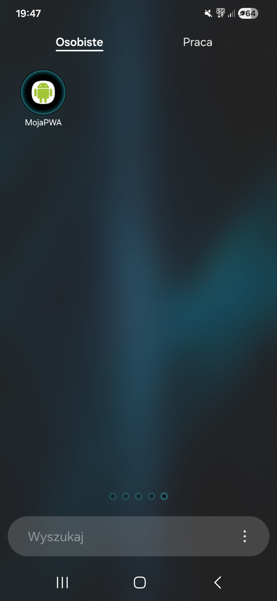

# Lab 01 – Progressive Web App

## Co zostało zrealizowane

W ramach laboratorium przygotowałem prostą aplikację typu Progressive Web App (PWA).

Aplikacja zawiera manifest z podstawowymi informacjami oraz ikonami wygenerowanymi w wymaganych rozmiarach. Zaimplementowałem service workera z wykorzystaniem biblioteki Workbox.

Dla stron HTML zastosowana została strategia `NetworkFirst`, a dla obrazów `CacheFirst`. Dzięki temu aplikacja działa również bez dostępu do Internetu.

Dodałem własną stronę `offline.html`, która jest wyświetlana przy próbie wejścia na nieistniejącą podstronę w trybie offline.

Aplikacja posiada również własny przycisk instalacji wykorzystujący zdarzenie `beforeinstallprompt`. Sprawdziłem instalację aplikacji w Google Chrome.

Aplikacja została przetestowana w Chrome DevTools oraz Lighthouse. Uzyskane wyniki:

- Performance: 100
- Accessibility: 100
- Best Practices: 100

Aplikacja została również opublikowana przez Firebase Hosting z wykorzystaniem połączenia HTTPS.

## Uruchomienie

Do uruchomienia aplikacji lokalnie potrzebny jest Node.js.

W terminalu należy przejść do katalogu:

```bash
cd lab_01/public
```

Następnie uruchomić lokalny serwer:

```bash
npx serve
```

W przypadku blokowania skryptów PowerShell można użyć:

```bash
npx.cmd serve
```

Po uruchomieniu aplikacja jest dostępna pod adresem wyświetlonym w terminalu, najczęściej:

```text
http://localhost:3000
```

Do testowania aplikacji użyłem przeglądarki Google Chrome oraz narzędzi DevTools.

## Opublikowana aplikacja

Aplikacja została opublikowana przez Firebase Hosting:

https://lab01-pwa.web.app

## Aplikacja na telefonie

Aplikacja została zainstalowana na telefonie z Androidem.

Widok ikony zainstalowanej aplikacji:



Widok uruchomionej aplikacji:


## Trudności / refleksja

Podczas realizacji laboratorium problemem było buforowanie starszych wersji plików przez service workera. Rozwiązaniem było zwiększanie wartości `revision` po zmianach plików oraz korzystanie z opcji `Update on reload` i `Clear site data` w Chrome DevTools.

Sprawdziłem również działanie aplikacji bez dostępu do sieci, własną stronę offline, proces instalacji PWA oraz publikację aplikacji przez Firebase Hosting.
